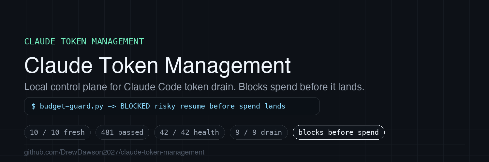
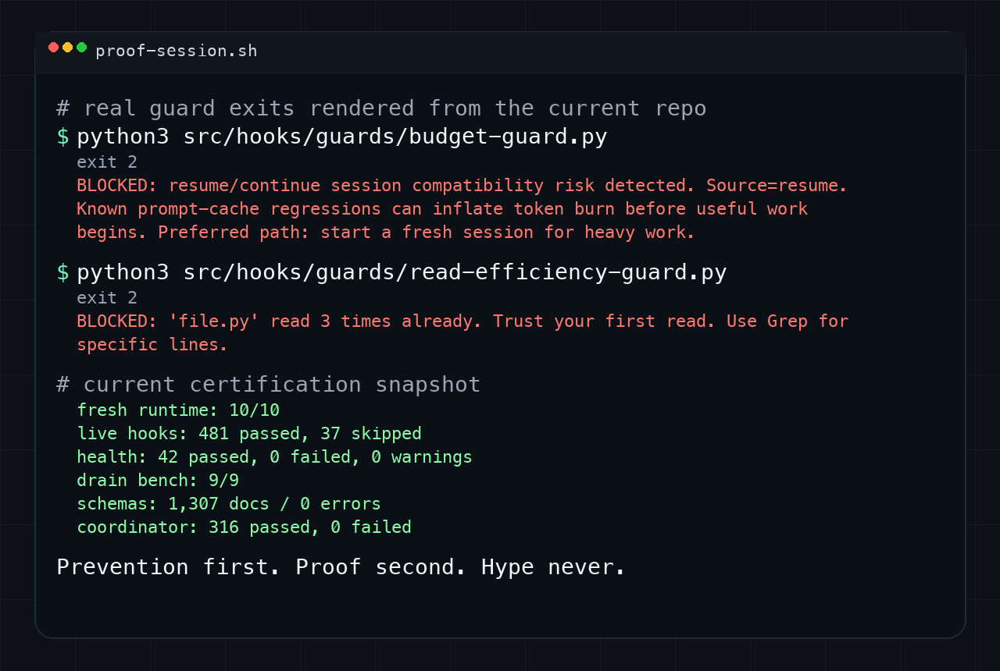

<div align="center">



</div>

<div align="center">

[](https://github.com/DrewDawson2027/claude-token-management/actions/workflows/certify.yml)
[](LICENSE)

<br />

[**Quick Start**](#30-second-quick-start) · [**Demo**](#demo) · [**Proof**](#proof) · [**Docs**](#core-docs)

</div>

---

> Local control plane for Claude Code token drain.
>
> Blocks avoidable spend before it lands, tracks known drain classes, and certifies the runtime with fresh and live proof.

---

## The Problem

Claude Code token drain is usually not one mysterious failure. It is a stack of local mistakes and upstream regressions that compound silently:

```text
resume session       -> prompt-cache risk returns before useful work starts
read same file 3x    -> repeated context spend for no new information
fan out too wide     -> oversized subagent cost and duplicated context
route to wrong model -> expensive work on the wrong tier
peak-hour burn       -> budget disappears before the operator sees it
```

## The Solution

```text
claude > continue heavy work in a risky resumed session

→ BLOCKED: resume/continue session compatibility risk detected.
→ Preferred path: start a fresh session for heavy work.
→ Duplicate reads are blocked before repeated file pulls land.
→ Operator gets local proof, certs, and burn visibility instead of guessing.
```

The point of this project is simple: move token control upstream of spend instead of treating cost as a report you inspect after the loss already happened.

---

## Demo

<div align="center">



</div>

---

## 30-Second Quick Start

```bash
git clone https://github.com/DrewDawson2027/claude-token-management.git
cd claude-token-management
npm run cert:all
python3 src/scripts/core/drain_bench.py --fixture tests/fixtures/token-drain-scenarios.json --json
```

If you want the shortest possible trust check, run `npm run cert:all` and inspect the generated proof surface before reading deeper.

## Proof

| Surface | Current proof |
| --- | --- |
| Fresh runtime certification | `10/10` checks green |
| Live hook suite | `481 passed, 37 skipped` |
| Live health-check | `42 passed, 0 failed, 0 warnings` |
| Drain benchmark | `9/9` passed |
| Schema validation | `1,307` documents, `0` errors |
| Coordinator source-tree suite | `316/316` |

## Before vs After

| Failure mode | Before | After |
| --- | --- | --- |
| Resume cache regression | silent token spike after reopening work | SessionStart warning plus explicit budget-guard ack gate |
| Redundant reads | repeated file pulls and burst-read waste | duplicate-read and burst-read controls |
| Fanout waste | too many agents spawned with oversized contexts | dispatch and budget gates block or constrain fanout |
| Bad routing | expensive model selected without justification | routing rules and reminders force cheaper safe paths first |
| Peak-hour burn | budget gets consumed without forecast | ops snapshots and burn projections flag it early |

## Current Status

- Live `~/.claude` runtime and repository sources were re-converged on 2026-04-07.
- Fresh-runtime certification passes: `10/10` checks green.
- Schema validation passes: `1,307` documents validated, `0` errors.
- Source-tree coordinator suite passes: `316/316`.
- Repo-native certification tests pass: `16 passed`.
- Live hook suite passes: `481 passed, 37 skipped`.
- Live runtime health-check passes: `42 passed, 0 failed, 0 warnings`.
- Live drain benchmark passes: `9/9`.
- Live compatibility summary reports `9` tracked issue classes with `unresolved_critical = 0`.

## Why It Exists

- Claude Code token usage spikes for reasons that are partly self-inflicted: repeated reads, weak task routing, wasteful subagent fanout, and long-session context bloat.
- Upstream issues like prompt-cache regressions and peak-hour throttling still matter, but they can be tracked, benchmarked, warned on, and routed around locally instead of being treated as invisible failures.
- This project turns those problems into a local control plane with prevention, telemetry, compatibility intake, certification, and operator workflows.

## What It Does

- Blocks wasteful or policy-breaking subagent dispatch before spend happens.
- Enforces read discipline through duplicate-read and burst-read controls.
- Tracks session, agent, and cost activity into local audit, metrics, and summary files.
- Surfaces burn, anomaly, budget, and ops views through Python reporting and statusline output.
- Tracks known Claude Code token-drain issue classes through a compatibility registry with repro commands, intake, and operator reporting.
- Runs a filesystem-native MCP coordinator with worker launch, messaging, planning, and lead tooling.
- Ships versioned schemas for the core record formats so file-backed state is contract-tested instead of implied.
- Blocks resumed or continued sessions with known prompt-cache risk until the operator explicitly acknowledges the compatibility warning.

## Repository Layout

```text
src/
  cli/claude_token_guard/      Unified operator CLI
  coordinator/                 MCP coordinator package and tests
  hooks/
    guards/                    Dispatch, budget, credential, shell, and read guards
    infrastructure/            Shared contracts, queue helpers, self-heal, context tools
    ops/                       Alerts, trends, recap, and ops snapshot builders
    routing/                   Model routing and prompt reminders
    runtime/                   Shell/runtime hooks and lifecycle helpers
    tracking/                  Session, agent, and lifecycle telemetry
  lead-tools/                  Shell wrappers for lead workflows
  scripts/
    core/                      Cost runtime, observability, pricing, policy tools
    analytics/                 Snapshot and savings analysis
    reporting/                 Higher-level operational reports
config/                        Canonical settings and policy/config inputs
data/                          Snapshots and fixtures for certification
docs/                          Architecture, operator, migration, release, and comparison docs
schemas/v1/                    JSON schemas for audit, metrics, alerts, summaries, and caches
tests/                         Fresh-runtime cert harness and schema validator
```

## Certification

Primary commands:

```bash
python3 tests/validate_schemas.py
python3 tests/run_token_system_regression.py
PATH="/opt/homebrew/bin:$PATH" /opt/homebrew/bin/npm --prefix src/coordinator test
```

Convenience wrappers:

```bash
npm run cert:schemas
npm run cert:a-plus:fresh
npm run cert:coordinator
npm run cert:all
```

## Community And Trust

- [CONTRIBUTING.md](CONTRIBUTING.md)
- [SECURITY.md](SECURITY.md)
- [CODE_OF_CONDUCT.md](CODE_OF_CONDUCT.md)
- [LICENSE](LICENSE)

## Core Docs

- `docs/architecture/system-overview.md`
- `docs/architecture/hook-lifecycle.md`
- `docs/architecture/data-flow.md`
- `docs/analysis/component-grades.md`
- `docs/analysis/production-readiness.md`
- `docs/analysis/regression-results.md`
- `docs/TOKEN_MANAGEMENT_OPERATOR_PLAYBOOK.md`
- `docs/TOKEN_MANAGEMENT_MIGRATION_GUIDE.md`
- `docs/COMPATIBILITY_MATRIX.md`
- `docs/RELEASE_PROCESS.md`

## Launch Assets

- `assets/social/readme-hero.png`
- `assets/social/runtime-demo.png`
- `assets/social/launch-proof.png`
- `assets/social/x-header.png`
- `docs/release/TWITTER_LAUNCH_SCRIPT.md`
- `docs/release/GITHUB_LAUNCH_COPY.md`
- `docs/release/LAUNCH_DAY_CHECKLIST.md`
- `docs/release/REPLY_PACK.md`

## Real Limits

- This is a local Claude Code control plane, not Anthropic's billing or rate-limit service.
- Upstream prompt-cache regressions, peak-hour throttling, and subscription policy changes are tracked, benchmarked, and worked around locally; the root platforms remain upstream-owned.
- The coordinator dependency tree is currently clean, but dependency hygiene remains an active maintenance obligation.
