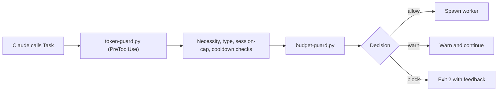
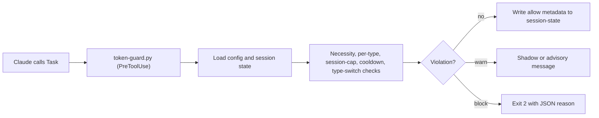
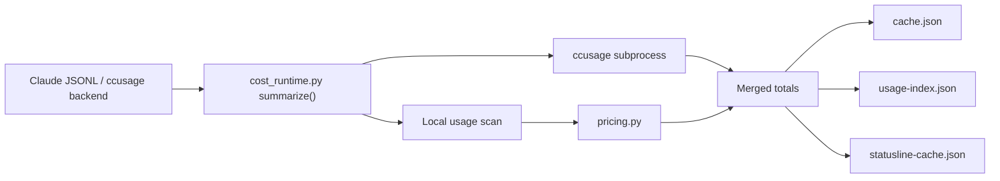
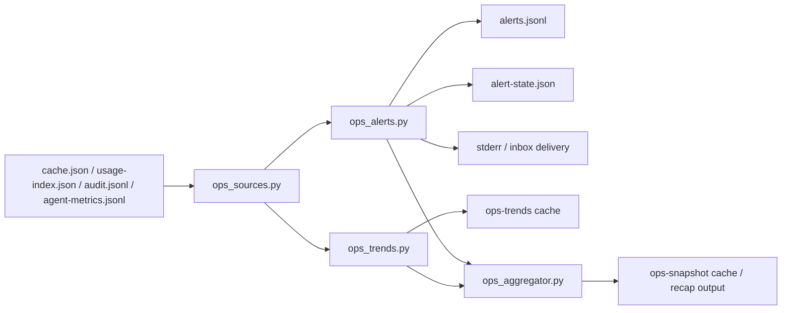
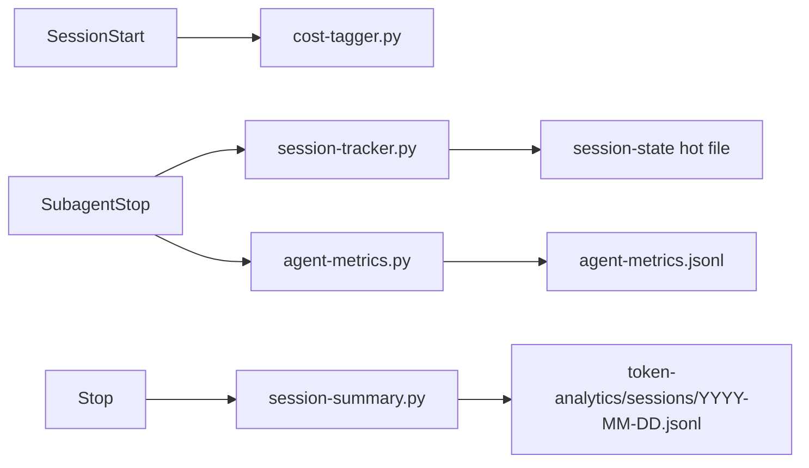
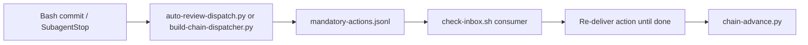

# Data Flow

This document maps the four required pipelines from the handoff and separates the intended architecture from the code paths that are actually present in the extracted snapshot.

## Pipeline A: Agent Dispatch Guard

### Intended path from the handoff

### Actual path in code

The live snapshot wires `token-guard.py` and `model-router.py` on `Task`, but not `budget-guard.py` (`config/settings-snapshot.json:185-206`). `token-guard.py` itself contains no budget-guard integration; its main flow loads config, evaluates rules 1-7, and persists allowed-agent metadata directly (`src/hooks/guards/token-guard.py:431-534`, `src/hooks/guards/token-guard.py:665-1123`). `budget-guard.py` is therefore an intended companion, not an actual step in the live dispatch path (`src/hooks/guards/budget-guard.py:3-24`).

## Pipeline B: Cost Tracking

`cost_runtime.py` owns the real aggregation path. It scans local JSONL usage records, optionally shells out to `ccusage`, computes budget status, writes `cache.json`, refreshes `usage-index.json`, and renders `statusline-cache.json` (`src/scripts/core/cost_runtime.py:205-291`, `src/scripts/core/cost_runtime.py:544-761`, `src/scripts/core/cost_runtime.py:917-974`). `pricing.py` is the clean pricing dependency that converts normalized model usage to USD (`src/scripts/core/pricing.py:94-211`).

Important divergence: `cost_data.py` claims the data layer was extracted out of `cost_runtime.py`, but `cost_runtime.py` still defines its own `UsageRecord`, `iter_usage_records`, `run_ccusage`, and `compute_budget_status` instead of importing `cost_data.py` (`src/scripts/core/cost_data.py:1-13`, `src/scripts/core/cost_data.py:46-333`, `src/scripts/core/cost_runtime.py:173-343`, `src/scripts/core/cost_runtime.py:544-652`).

## Pipeline C: Alerting

`ops_alerts.py` reads cost and audit sources, applies cooldown-based deduplication, writes `alerts.jsonl`, maintains `alert-state.json`, and can deliver to stderr or inbox markdown (`src/hooks/ops/ops_alerts.py:30-156`, `src/hooks/ops/ops_alerts.py:194-291`). `ops_aggregator.py` parallelizes summary, budget, burn-rate, anomaly, and trend reads into a cached `ops-snapshot` view (`src/hooks/ops/ops_aggregator.py:124-273`). `ops_trends.py` directly scans project JSONL to produce rolling daily series and summary deltas (`src/hooks/ops/ops_trends.py:75-157`, `src/hooks/ops/ops_trends.py:206-236`).

The gap is lifecycle integration. These scripts are implemented, but the settings snapshot does not wire them as live hooks (`config/settings-snapshot.json:143-325`). In practice, they are CLI-style tools or opportunistic shell-outs from `cost_runtime.py`, not a fully live reactive alert pipeline (`src/scripts/core/cost_runtime.py:1717-1752`).

## Pipeline D: Session Lifecycle

The settings snapshot really wires this pipeline: `cost-tagger.py` on `SessionStart`, `agent-metrics.py` and `session-tracker.py` on `SubagentStop`, and `session-summary.py` on `Stop` (`config/settings-snapshot.json:112-139`, `config/settings-snapshot.json:263-287`, `config/settings-snapshot.json:300-325`). The session tracker updates a hot per-session JSON file with offset-based incremental reads, the agent metrics hook parses actual transcript usage, and the stop hook writes day-level summaries and cleans up the hot state (`src/hooks/tracking/session-tracker.py:72-249`, `src/hooks/tracking/agent-metrics.py:138-205`, `src/hooks/tracking/session-summary.py:30-102`).

This is the cleanest end-to-end pipeline in the project.

## Pipeline E: Mandatory Action Queue (Broken in the extracted project)

The extracted project only contains the producer side. `auto-review-dispatch.py` and `build-chain-dispatcher.py` both write to `mandatory-actions.jsonl`, and `chain-advance.py` explicitly says a `check-inbox.sh` consumer will pick up done markers and advance chain state (`src/hooks/infrastructure/auto-review-dispatch.py:2-10`, `src/hooks/infrastructure/build-chain-dispatcher.py:2-9`, `src/hooks/infrastructure/chain-advance.py:2-9`). No `check-inbox.sh` consumer exists in the extracted tree, so the pipeline is incomplete here even before considering live-environment drift.

## Summary

Two pipelines are genuinely live and coherent in the copied snapshot:

- Task/read enforcement.
- Session telemetry.

Two other pipelines are implemented but structurally weaker:

- Cost aggregation is powerful but internally duplicated.
- Alerting is substantial but mostly manual or sidecar-triggered.

The mandatory-action chain is not complete inside this extracted project.
